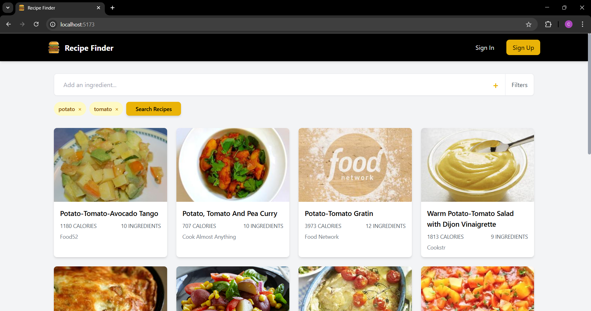
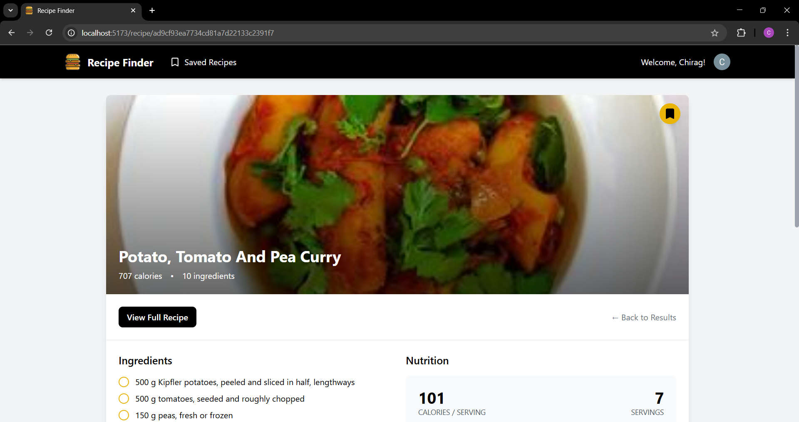
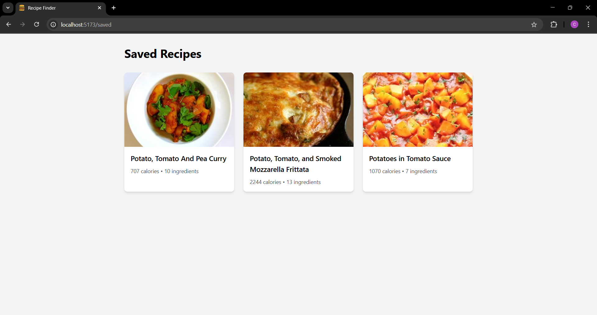

# 🍽️ RecipeFinder

## 🔍 Discover Recipes Tailored to Your Taste

Welcome to **RecipeFinder**, a web application designed to help food lovers discover and explore recipes from around the world. Whether you're a seasoned chef or a home cook, this platform lets you find recipes based on ingredients you have, cuisine preferences, and dietary needs.

---

## 👨‍💻 Project By: [@chiragcs8](https://github.com/Chiragcs8)

## 🚀 About Me
Hi, I'm **Chirag!** 👋  
I'm a passionate full stack developer, and this is one of my first projects which is completely done by me from scratch combining frontend and backend technologies to create something useful and exciting.

---

## ✨ Features

- 🔎 **Ingredient-Based Search**: Input available ingredients and get matching recipes.
- 🧑‍🍳 **Recipe Details**: View cooking steps, ingredients, and preparation time.
- ❤️ **Favorites**: Save your favorite recipes for quick access.
- 📱 **Responsive Design**: Works smoothly on mobile, tablet, and desktop.
- 🌐 **Multi-Cuisine Support**: Explore dishes from various cultures.

---

## 🛠️ Technologies Used

### Frontend
- **HTML5, CSS3, JavaScript** – Core web development stack.

### Backend
- **Node.js** – JavaScript runtime for building scalable server-side logic.
- **Express.js** – Simplifies backend routing and middleware.

### Database
- **MongoDB** – NoSQL database for storing recipes and user data.
- **Mongoose** – MongoDB object modeling for Node.js.

### Additional Libraries/Tools
- **Axios** – Handles API requests on the frontend.
- **EJS** – Template engine for rendering dynamic content.
- **Multer** *(if file uploads)* – Handles file uploads for images.
- **Dotenv** – Manages environment variables securely.

---

## ⚙️ Setup Instructions

1. **Clone the repository:**
   ```bash
   git clone https://github.com/Chiragcs8/RecipeFinder.git
   cd RecipeFinder
   ````

2. **Install dependencies:**

   ```bash
   npm install
   ```

3. **Setup your environment:**
   Create a `.env` file in the root directory and add:

   ```
   MONGO_URI=your_mongodb_connection_string
   PORT=5000
   ```

4. **Run the development server:**

   ```bash
   npm run dev
   ```

5. Open your browser and navigate to `http://localhost:5173`

---

## 📸 Screenshots

  ###  HomePage

  

  ### RecipeDetailPage

  

  ### SavedRecipePage

  


---

## 💬 Feedback

Feel free to [open an issue](https://github.com/Chiragcs8/RecipeFinder/issues) or reach out for any suggestions or improvements!


